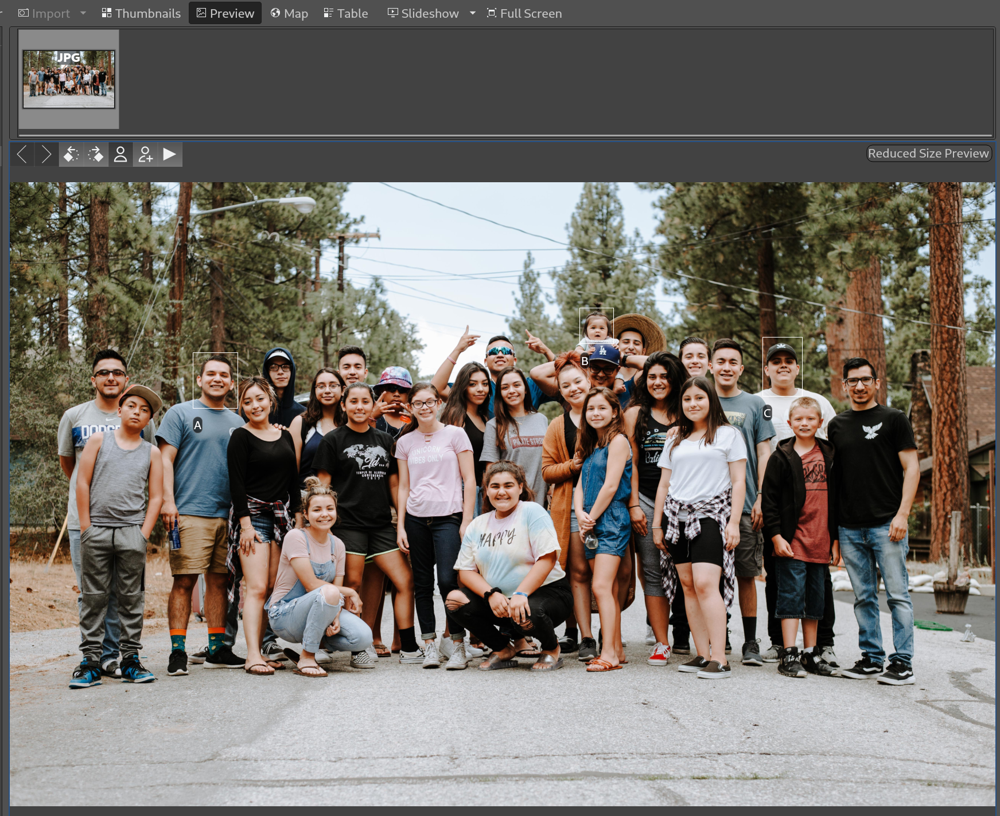
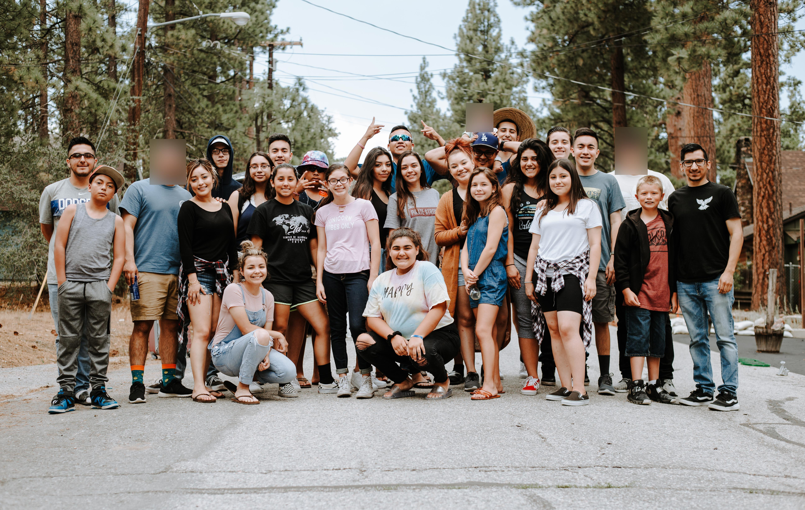

# Blur persons and objects in your images based on exif metadata

## Example Workflow

1) Face-tag persons with their names on your pictures
   * This can be done with e.g. `DigiKam`

> Screenshot of DigiKam with three tagged persons (named "A", "B" and "C"):
> 
> 

2) Copy all pictures to be modified in a folder

> See [example/](example/)

3) Run this python script on that folder with a list of names of persons to be blurred

> In `main.py` the three names are specified:
> ```
> names = ['A', 'B', 'C']  # TODO: Enter name of persons to be blurred
> ```
>
> This results in the following picture:
> 
> 


## Credits

Many thanks to

* https://www.thregr.org/~wavexx/software/facedetect/#blurring-faces-within-an-image
* "Make blur all around a rectangle in image with PIL", https://stackoverflow.com/q/56987112/6334421
* Example image: https://unsplash.com/photos/1qfy-jDc_jo?utm_source=unsplash&utm_medium=referral&utm_content=creditShareLink